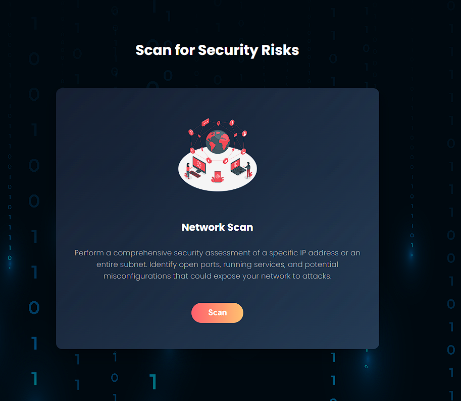

[](https://mjolnir-uy37.vercel.app/)


Mjolnir is a web-based network scanner designed to analyze a specific IP address or an entire subnet to gather detailed network information. The scanner performs a range of active and passive reconnaissance techniques to provide insights into the network structure and host behavior. Later it also provides a list of CVEs for that IP which are fetched from The NVD.


## Table of Contents

- [Features](#features)
- [Screenshots](#screenshots)
- [Installation](#installation)
- [Limitations](#limitations)    
- [License](#license)    


## Features

**ICMP Scanning**: Sends multiple ICMP types (Echo, Timestamp, Mask) and interprets various response codes.

**Firewall Detection**: Detects firewall behavior by analyzing responses to TCP and ICMP packets.

**OS Detection**: Estimates the target's operating system using TTL and TCP window size analysis. Since it is a passive fingerprinting technique the exact details of the OS can not be provided.

**Port Scanning**: Classifies ports as open, filtered, or closed for both TCP and UDP services.

**Service Identification**: Maps open ports to common services using standard port-to-service mappings.

**Packet Summary**: Provides a concise summary of the captured packets exchanged during the scan.

**Database Handling**: Caching ensures subsequent scans of the same IP are significantly faster.

**CVE report** : A report of the detected vulnerabilities is generated using NVD API key.

**Web Interface**: Simple, intuitive interface accessible through a browser. No need for command-line tools.


## Screenshots

### Try the scanner live 
Access the deployed frontend here: [**Mjolnir**](https://mjolnir-uy37.vercel.app/)


### Application Walkthrough

#### 1. **Landing Page**
*Shows the home page with navigation to Dashboard, Report, About, Contact, Codex and Starting the scan.*


#### 2. **Scan Input Page**  
*User interface to input IP address and trigger the scan.*

<p align="center">
  
  
</p>


#### 3. **Dashboard Display**  
*Displays the results of the scan. The demo shows few results of the ip **127.0.0.1** which are safe to display*

<p align="center">
  
  
</p>

### 4. **CVE Report**
*Displays the vulnerabilities loaded from the NVD database*


#### 5. **About Page**  
*Provides information about the project’s purpose and features.*


#### 5. **Codex**  
*Offers detailed explanation of how to use the scanner and what does it really do*


## Installation

1. Clone the repository:

    ```bash
    git clone https://github.com/16aurora/Mjolnir
    cd Mjolnir
    ```

2. Database Setup

-Navigate to the `database` folder

    ```bash
    cd backend/database
    ```

-Run the following command to create the results.db file:

    ```bash
    python db_setup.py
    ```

3. Environment Variables  

- In the project root folder, create a .env file and write this inside the file:

    ```bash
    NVD_API_KEY=your_nvd_api_key_here
    ```

- Make sure you have an activated and valid API key.You can request a free API key from the National Vulnerability Database (NVD) here:  
[Request NVD API Key](https://nvd.nist.gov/developers/request-an-api-key)    


4. Backend Setup

- Navigate to the backend folder

    ```bash
    cd backend
    ```

- Create and activate a virtual environment

    ```bash
    python -m venv venv
    source venv/bin/activate  # On Windows: venv\Scripts\activate
    ```

- Install backend dependencies

    ```bash
    pip install -r requirements.txt
    ```

- Run the backend server

    ```bash
    python app.py
    ```

5. Frontend Setup

- Open a new terminal and navigate to the frontend folder

    ```bash
    cd frontend
    ```

- Install frontend dependencies

    ```bash
    npm install
    ```    

- Start the frontend development server

    ```bash
    npm run dev
    ```
        

## Limitations

- **Restricted IP Scanning**: The scanner may not be able to probe certain IP addresses due to security measures such as firewalls, intrusion detection systems, or rate-limiting policies that block or filter scan traffic. This is a common limitation shared by even well-known tools like Nmap.

- **OS Fingerprinting Accuracy**: The tool uses passive techniques for OS detection, relying on factors like TTL and TCP window size. As a result, the identified operating system may not be exact, and any inferred vulnerabilities might not accurately reflect the specific version or configuration in use.

## License


